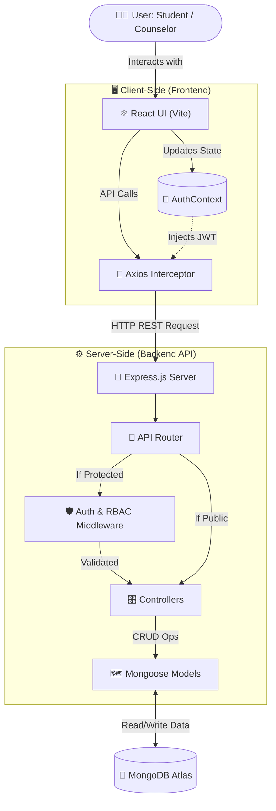

# 🌿 MindCare - Mental Health Support System

---

## 📌 1. Project Overview
**MindCare** is a full-stack, comprehensive mental health support platform designed to help students manage academic stress 📚, track their emotional well-being 🧠, and securely connect with professional counselors 👨‍⚕️. 

The system consists of a calming, responsive **React.js Frontend** (interactive self-help tools and dashboards) and a highly secure, robust **Node.js/Express Backend API** (managing authentication, data persistence, and role-based request routing).

---

## 🎯 2. Problem Description
Students frequently experience academic stress and emotional challenges but face high barriers to getting help.
*   🤐 **Stigma & Barriers:** Students feel uncomfortable seeking in-person help, and existing platforms lack engaging daily self-help tools.
*   🚨 **Security Risks:** Mental health platforms deal with highly sensitive medical data (PII). A poorly secured architecture risks catastrophic data breaches.
*   🚧 **Access Segregation:** Handling different user roles (Students seeking help vs. Counselors providing help) requires a strict access control system to protect privacy.

---

## 💡 3. Proposed Solution
MindCare bridges the gap by providing a decoupled, secure, and user-friendly ecosystem:
*   🛠️ **Proactive Self-Help (Frontend):** Offers daily journaling, mood tracking, guided mindfulness exercises, and academic stress management to prevent crises.
*   🤝 **Professional Bridge (Full Stack):** Students can securely submit support requests. Verified counselors receive these on a dedicated dashboard to provide human intervention.
*   🛡️ **Ironclad Security (Backend):** Built as a decoupled RESTful API with MongoDB. It utilizes JWT stateless sessions, bcrypt password hashing, and custom Role-Based Access Control (RBAC) to ensure student data is invisible to unauthorized users.

---

## ✨ 4. Key Features & Functionality

### 👔 4.1 Role-Based Dashboards
*   🎓 **Student Dashboard**: Quick access to mood trackers, journals, academic tools, and active support request statuses.
*   💼 **Counselor Dashboard**: A secure interface for professionals to view incoming student requests, manage caseloads, and update therapy statuses.

### 🧘‍♀️ 4.2 Mental Health & Self-Therapy Tools
*   📊 **Mood Tracker**: Visual logging of daily emotions to identify patterns over time.
*   📓 **Daily Journal (Text & Voice)**: A secure space for reflection with integrated voice-to-text.
*   ⏱️ **Mindfulness Timer**: Guided breathing exercises (e.g., 4-7-8 technique) for immediate anxiety relief.

### 🔀 4.3 Secure Request Routing & API
*   ⚙️ **CRUD Operations**: Full lifecycle management for support requests.
*   🚦 **Status Tracking**: Requests transition through states (`Pending`, `In Progress`, `Resolved`) managed by counselors.

---

## 🏗️ 5. Technologies & Architecture (MERN Stack)

### 💻 5.1 Full-Stack Technologies
*   **Frontend**: React.js (v19), Vite, React Router DOM, Context API, Axios, Vanilla CSS.
*   **Backend**: Node.js, Express.js, JSON Web Tokens (JWT), bcryptjs, CORS.
*   **Database**: MongoDB (Atlas Cloud) & Mongoose ODM.

### 🏗️ 5.2 Complete System Architecture Diagram



---

## 🌐 6. API Documentation & Database Schema

### 🗃️ 6.1 Database Schema (MongoDB)
*   🧑‍🎓 **`User` (Student)**: `name`, `email` (unique), `password` (hashed), `role` (default: 'student').
*   👨‍⚕️ **`Counselor`**: `name`, `email`, `password` (hashed), `specialization`, `role` (default: 'counselor').
*   ✉️ **`Request`**: `studentId` (ref: User), `title`, `description`, `status`, `counselorAssigned` (ref: Counselor).

### 🔑 6.2 Key REST Endpoints
*   🟢 **Auth**: `POST /api/auth/register-user`, `POST /api/auth/login` (Public)
*   🟡 **Student**: `POST /api/requests` (Submit request)
*   🔴 **Counselor**: `GET /api/requests` (View queue), `PUT /api/requests/:id` (Update status)

---

## 📂 7. Project Structure
```text
Mental_Health_Support_Sytem/
+--- Backend/ ⚙️
|   +--- .env 🔐
|   +--- .gitignore 🙈
|   +--- config/
|   |   \--- db.js
|   +--- controllers/
|   |   +--- authController.js
|   |   +--- counselorController.js
|   |   +--- requestController.js
|   |   \--- userController.js
|   +--- index.js 🚀
|   +--- middleware/
|   |   +--- authMiddleware.js
|   |   \--- roleMiddleware.js
|   +--- models/
|   |   +--- counselorModel.js
|   |   +--- requestModel.js
|   |   \--- userModel.js
|   +--- package-lock.json 📦
|   +--- package.json 📦
|   +--- routes/
|   |   +--- authRoutes.js
|   |   +--- counselorRoutes.js
|   |   +--- requestRoutes.js
|   |   \--- userRoutes.js
|   +--- screenshots/ 📸
|   |   +--- auth/
|   |   |   +--- login.png
|   |   |   +--- register-counselor.png
|   |   |   \--- register-user.png
|   |   +--- counselors/
|   |   |   \--- Get-counselors.png
|   |   +--- mongodb/
|   |   |   +--- counselors-data.png
|   |   |   +--- count-documents.png
|   |   |   +--- database-collection.png
|   |   |   +--- requests-data.png
|   |   |   \--- users-data.png
|   |   +--- requests/
|   |   |   +--- create-request.png
|   |   |   +--- delete-request.png
|   |   |   +--- Get-Requests.png
|   |   |   \--- update-request.png
|   |   \--- users/
|   |       \--- Get-users.png
|   \--- utils/
|       \--- generateToken.js
|
+--- Frontend/ ⚛️
|   +--- .env 🔐
|   +--- eslint.config.js ⚙️
|   +--- index.html 📄
|   +--- package-lock.json 📦
|   +--- package.json 📦
|   +--- public/
|   |   +--- favicon.svg 🖼️
|   |   \--- icons.svg 🖼️
|   +--- ScreenShots/ 📸
|   |   +--- breath exercise page.png
|   |   +--- Counselor account.png
|   |   +--- Counselor Dashboard 2.png
|   |   +--- Counselor Dashboard.png
|   |   +--- Counselor list page.png
|   |   +--- Landing page (Home page)4.png
|   |   +--- Landing page (Home).png
|   |   +--- Landing Page (Home)2.png
|   |   +--- Landing page (Home)3.png
|   |   +--- Login Page.png
|   |   +--- Screenshot 2026-05-16 122043.png
|   |   +--- Self Theraphy hub.png
|   |   +--- Self therapy hub 2.png
|   |   +--- Self Therapy Hub 3.png
|   |   +--- Sign up (Register) page for Counselor.png
|   |   +--- Sign up (Register) page for student.png
|   |   +--- Sttings bar.png
|   |   +--- Student account page.png
|   |   +--- student Dashboard.png
|   |   \--- Student list page.png
|   +--- src/
|   |   +--- api/
|   |   |   +--- authApi.js
|   |   |   +--- axiosInstance.js
|   |   |   +--- counselorApi.js
|   |   |   \--- requestApi.js
|   |   +--- App.jsx ⚛️
|   |   +--- assets/
|   |   |   +--- auth_bg.png
|   |   |   +--- hero.png
|   |   |   +--- react.svg
|   |   |   +--- slide1.png
|   |   |   +--- slide2.png
|   |   |   +--- slide3.png
|   |   |   +--- slide4.png
|   |   |   +--- slide5.png
|   |   |   \--- vite.svg
|   |   +--- components/
|   |   |   +--- Loader.jsx
|   |   |   +--- Navbar.jsx
|   |   |   \--- RequestCard.jsx
|   |   +--- context/
|   |   |   \--- AuthContext.jsx
|   |   +--- data/
|   |   +--- index.css 🎨
|   |   +--- main.jsx 🚀
|   |   +--- pages/
|   |   |   +--- AcademicManager.jsx
|   |   |   +--- CounselorDashboard.jsx
|   |   |   +--- CounselorsListPage.jsx
|   |   |   +--- DailyJournal.jsx
|   |   |   +--- LandingPage.jsx
|   |   |   +--- LoginPage.jsx
|   |   |   +--- MindfulnessTimer.jsx
|   |   |   +--- MoodTracker.jsx
|   |   |   +--- ProfilePage.jsx
|   |   |   +--- RegisterPage.jsx
|   |   |   +--- RequestDetailsPage.jsx
|   |   |   +--- SelfTherapyPage.jsx
|   |   |   +--- StudentDashboard.jsx
|   |   |   \--- UsersListPage.jsx
|   |   \--- routes/
|   |       \--- ProtectedRoute.jsx
|   \--- vite.config.js ⚙️
|
\--- README.md 📖
```

---

## 🚀 8. Setup & Installation Instructions

### 📋 Prerequisites
*   Node.js (v16+) & npm
*   MongoDB Instance (Local Compass or Cloud Atlas)

### 📥 8.1 Clone & Setup Backend
```bash
cd Backend
npm install
```
Create a `.env` file in the `Backend/` directory:
```env
PORT=5000
MONGO_URI=mongodb+srv://<username>:<password>@cluster.mongodb.net/mindcare
JWT_SECRET=your_super_secret_key_here
```
Run the backend server:
```bash
npm start
```

### 📥 8.2 Setup Frontend
Open a new terminal tab:
```bash
cd Frontend
npm install
```
Create a `.env` file in the `Frontend/` directory:
```env
VITE_API_URL=http://localhost:5000/api
```
Run the frontend development server:
```bash
npm run dev
```
Access the platform at `http://localhost:5173`. 🌐

---

## 🧪 9. Testing & Deployment Strategy

### 📬 Testing
*   **API Testing**: Postman was utilized extensively to manually test all RESTful endpoints, verify JWT tokens, and ensure RBAC constraints.
*   **Automated (Proposed)**: Jest for utility testing, Supertest for integration routing, and Cypress for E2E frontend flows.

### ☁️ Deployment (Proposed)
*   **Frontend**: Vercel or Netlify (Configure environment variables securely).
*   **Backend**: Render or Heroku (Ensure CORS middleware is updated to only allow the production frontend URL).

---

## 📦 10. Deliverables
*   💻 **Source Code**: Complete MERN stack repository (Frontend + Backend).
*   📖 **Documentation**: This comprehensive README file detailing architecture and setup.
*   🗺️ **Database Schema**: Structured Mongoose models.
*   📸 **Demonstrations**: Screenshots of UI interfaces and Postman API proofs located in the respective subdirectories.

---

## ⚠️ 11. Threats & Limitations
*   ⏱️ **Database Uptime**: Network latency or MongoDB cluster downtime will cause cross-system API failures.
*   🧹 **Data Persistence**: If local storage is cleared by the user, their active JWT session is lost, requiring re-authentication.
*   📈 **Scalability**: The backend currently relies on a single Node.js thread. Massive user loads would require clustering.

---

## 🏁 12. Conclusion
MindCare successfully delivers a secure, decoupled, and efficient full-stack platform for mental health support 🌿. By integrating daily self-help tools with a direct, secure line to professional counselors via robust RBAC, it lowers the barrier to entry for mental health care and ensures student privacy is strictly maintained. 🎓🤝

---

## 👩‍💻 Developed By
**Harshani Sandunika Ranasingha**  
💳 **Student ID**: 2022/ict/78
